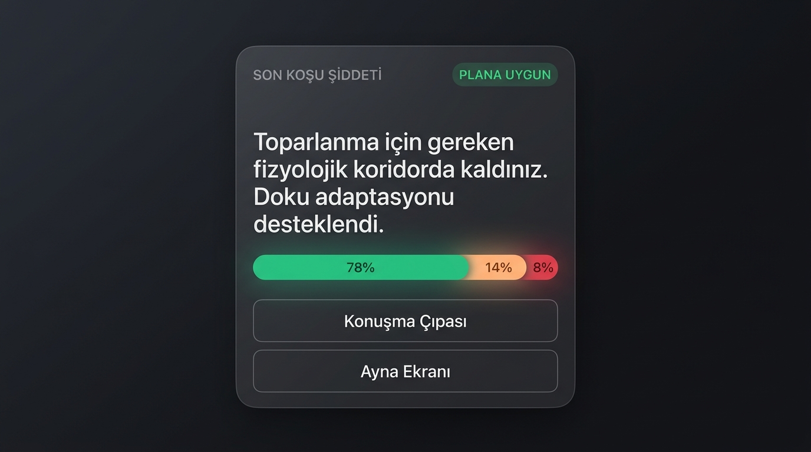
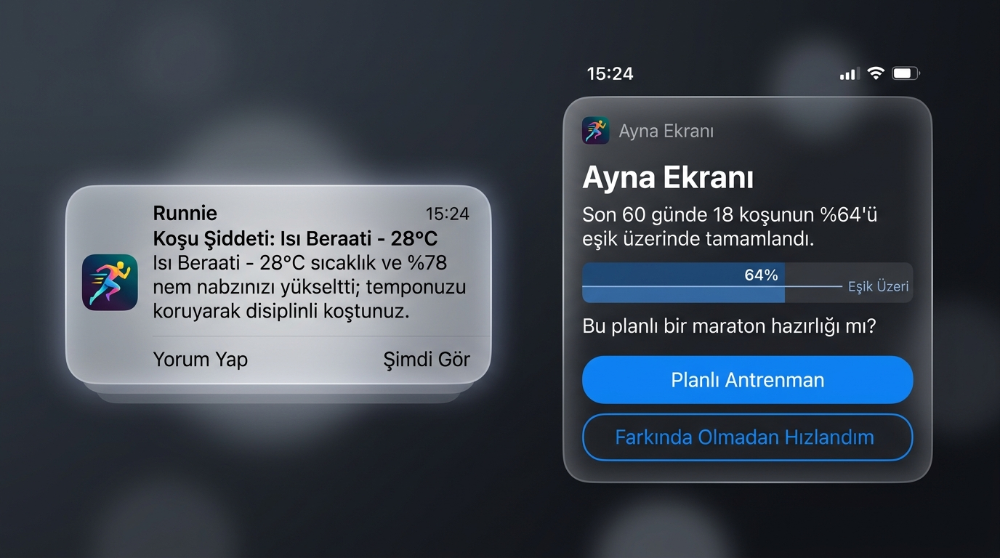

# Runnie

### *"Bu koşu olması gereken şiddette miydi?"*

**Orta seviye koşucular için koşu sonrası fizyolojik dürüstlük motoru.**  
Oyunlaştırma yok. Sosyal akış yok. Seri baskısı yok.  
Yalnızca antrenman bittikten sonraki 3 dakika içinde gelen net, tavizsiz ve bilimsel bir cevap var.

 

 

---

## 🏃 Neden Runnie?

### Ortopedik ve Aerobik Uyumsuzluk Tuzağı
Koşuya başlayan veya derecelerini geliştirmek isteyen çoğu koşucunun sakatlanmasının ya da plato çizmesinin temel bir fizyolojik nedeni vardır:

> **Kalp ve damar sistemi 3–4 hafta içinde hissedilir bir güç kazanırken; kemik, tendon, kıkırdak ve fasya dokularının mekanik yüke uyum sağlaması 6 ila 9 ay sürer.**

Koşucu kendini harika hisseder; bacakları hafif gelir. Ancak kolay (Zone 2) koşulması gereken günler, farkında olmadan biraz daha hızlı koşulur ve metabolik **"Gri Bölge"ye (Zone 3)** girilir. 
- Yeterince sert olmadığı için kardiyovasküler kapasiteyi geliştirmez.
- Yeterince yavaş olmadığı için bağ dokusu toparlanamaz.
- Sonuç: Biriken ortopedik yorgunluk, tendon hasarları, kaval kemiği ağrıları (shin splints) ve aylar süren duraksama.

**Runnie, sizi bu tuzaktan korumak için tasarlandı.** Saatinizdeki sensör verilerini alır, çevresel koşulları hesaba katar ve antrenmanınızın fizyolojik amacına sadık kalıp kalmadığını yüzünüze söyler.

---

## ✨ Temel Yetenekler

 

 

### 1. Koşu Sonrası Dürüstlük Kartı (The Honesty Card)
Koşunuz bittiği anda HealthKit üzerinden verileriniz akar ve 3 dakika içinde bildiriminiz gelir. LLM gevezeliği ya da genel geçer tavsiyeler yoktur; doğrudan deterministik şablonlardan üretilmiş dürüst Türkçe hüküm verilir:
- **Plana Uygun:** Toparlanma koridorunda kalındı, bağ dokusu adaptasyonu desteklendi.
- **Gri Bölge Sapması:** Kolay koşu farkında olmadan hızlandırıldı; toparlanma maliyeti gereksiz yükseldi.
- **Eşik Aşımı:** Seans sert bir antrenmana dönüştü.
- **Sınır Koridoru:** Fizyolojik belirsizlik alanında tamamlandı.

### 2. Isı Beraati (Heat Acquittal Mechanism)
Yazın $30^\circ\text{C}$ sıcaklıkta ve nemli havada koşarken nabzınızın yükselmesi eforunuzun disiplinsiz olduğu anlamına gelmez; kanın deriye pompalanması (kardiyak drift) doğal bir savunma mekanizmasıdır.
- Runnie, koşunun yapıldığı saatteki hava durumunu Open-Meteo üzerinden sorgular.
- Eğer sıcaklık ve nem yüksekken temponuzu yavaş tuttuysanız, nabzınız yükselse bile Runnie bunu bir ihlal saymaz: **"Isı Beraati"** verir.
- Havanın cezasını koşucuya kesmez.

### 3. Dört Bölgeli Metabolik Dağılım
Geleneksel saatlerin kaba "5 Bölge" ayrımı yerine fizyolojik gerçeğe sadık 4 bant takip edilir:
1. **Kesin Kolay:** $AeT$ eşiğinin altı (Doku onarımı ve mitokondriyal yoğunluk bölgesi).
2. **Belirsizlik Koridoru:** $AeT$ civarındaki bireysel hata payı aralığı.
3. **Kesin Gri Bölge:** Kolay koşuları zehirleyen, toparlanmayı baltalayan efor.
4. **Eşik Üstü:** Kaliteli antrenman veya yarış eforu.

### 4. Konuşma Testi Çıpası (Talk Test Anchor)
Laboratuvarda kan laktat testi yaptırmamış koşucuların Aerobik Eşiğini ($AeT$) sabit yaş formülleriyle (220 - Yaş vb.) hesaplamak $\pm 15\text{ bpm}$ hata üretir.
- Runnie, kolay bir koşudan sonra koşucuya tek bir soru sorar: *"Bu koşuda tam ve kesintisiz cümleler kurabiliyor muydunuz?"*
- Bu yanıt, motorun eşik modelini doğrudan bireysel olarak kalibre eden sarsılmaz bir çıpa haline gelir.

### 5. Akış İçi İnterval Tespiti
Koşucu antrenman başlığına "Sabah Kolay Koşusu" yazmış olsa bile, akıştaki hız ve nabız patlamalarının varyansından seansın bir interval veya tempo koşusu olduğu otomatik anlaşılır. Yanıltıcı başlıklara kanmaz.

### 6. Ayna Ekranı (The Mirror Screen)
Son 60 günde en az **16 koşu** ve **100 km** tamamlandığında açılır.
- Nasihat etmez, puan vermez, azarlamaz.
- Koşucunun önüne alışkanlıklarını ayna gibi koyar:
  > *"Son 60 günde 18 koşunun %64'ü eşik üzerinde tamamlandı. Bu dağılım planlı bir maraton hazırlığı mı, yoksa toparlanma günlerinin farkında olmadan hızlanması mı?"*

---

## 🛡️ Runnie Neyi Yapmaz? (Felsefemiz)

| ❌ Piyasada Olanlar | ✅ Runnie Standartları |
| :--- | :--- |
| **Sosyal Akış & Beğeni** | Koşu kişisel bir disiplindir. Kimsenin "kudos"una veya onayına ihtiyaç duymazsınız. |
| **Seri / Gün Sayacı Baskısı** | "Bugün de koşmalısın" demez. Bazen en iyi koşu, evde oturup dinlenmektir. |
| **Sahte Bilim & Uydurma Terimler** | "Laktik asit birikti", "Yağ yakma modu", "Stres puanınız 84", "48 saat yatın" gibi biyolojik karşılığı olmayan terimler motorda kesin olarak yasaklanmıştır. |
| **Konum & Mahalle Takibi** | Konumunuz asla kaydedilmez. Koordinat yalnızca anlık hava durumunu sorgulamak için belleğe alınır ve saniyeler içinde tamamen yok edilir. |
| **Şifre ve Kayıt Sürtünmesi** | Cihaz tabanlı güvenli jeton mimarisiyle çalışır. E-posta onayları, şifreler, üçüncü taraf izin duvarları yoktur. |

---

## 📱 Ekran Görüntüleri ve Arayüz

Runnie, göz yormayan derin karanlık mod (OLED Dark Mode) ve Apple tasarım çizgileriyle inşa edilmiştir.

 

| Dürüstlük Kartı & Dağılım | Isı Beraati & Ayna Ekranı |
| :---: | :---: |
|  |  |
| *Son seansın fizyolojik maliyetini ve 4 bölgeli bant dağılımını gösteren ana arayüz.* | *Kilitli ekranda 3 dakikada beliren Isı Beraati bildirimi ve 60 günlük Ayna Ekranı.* |

---

## 🔬 Mimari ve Bilimsel Çerçeve

- **İstemci:** Swift, SwiftUI, HealthKit (`HKWorkout`, `HKQuantityTypeIdentifierRunningSpeed`, `HKWorkoutRouteQuery`).
- **Sunucu & Motor:** Node.js çekirdeği (`node:sqlite`, `node:crypto`, `node:http`). Harici hiçbir üçüncü taraf npm bağımlılığı barındırmaz.
- **Düzeltilmiş Minetti Maliyeti:** Yokuş yukarı ve yokuş aşağı koşularda yerçekimi enerji maliyetini Minetti (2002) metabolik güç faktörüyle (GAP) hesaplar.
- **Kadans Kilitlenmesi Filtresi:** Optik nabız sensörlerinin adım frekansıyla kilitlendiği ($|HR - CAD| \le 3\text{ bpm}$) sahte nabız anomalilerini tespit eder.
- **Sürümlenmiş Eşikler:** Kalibrasyon değiştiğinde eski antrenmanlar sessizce manipüle edilmez; geriye dönük yeniden kalibre edildiği dürüstçe belirtilir.

---

  Runnie, kulüp koşucuları ve sakatlık döngüsünden çıkmak isteyen sporcular için geliştirilmiştir.

